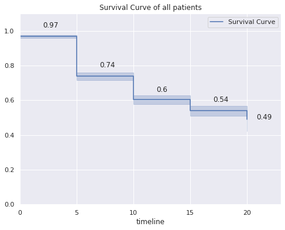

# Exploratory Data Analysis


```python
from dateutil.relativedelta import relativedelta
import matplotlib.pyplot as plt
from datetime import datetime
import seaborn as sns
import pandas as pd
import numpy as np
import matplotlib
import math
import re
```

## 1.- Read data


```python
df_ca=pd.read_excel("patient_survival_ca_prostate_00-10.xlsx", 
                    index_col=None,
                    na_values= np.nan)
```

To anonymize the database, the column containing the medical record number of all patients is removed. A new dataFarme is also created to assign each medical record to a number and, subsequently, to be able to trace each one.


```python
df_final=df_ca.sort_values(["F.Diagnóstico"],ascending=True).reset_index()
df_HCL=df_final[["index","Num.HCL"]]
df_final.drop(["Num.HCL","Num_HCL"], axis=1,inplace=True)
```

## 2.- Data exploration


```python
pd.set_option('display.max_columns', 15)
pd.set_option("max_colwidth", 18)
pd.set_option('display.max_rows', 22)
```


```python
df_final.head()
```


<div>
<style scoped>
    .dataframe tbody tr th:only-of-type {
        vertical-align: middle;
    }

    .dataframe tbody tr th {
        vertical-align: top;
    }

    .dataframe thead th {
        text-align: right;
    }
</style>
<table border="1" class="dataframe">
  <thead>
    <tr style="text-align: right;">
      <th></th>
      <th>index</th>
      <th>Edad Diag.</th>
      <th>Cod Diag</th>
      <th>Diagnóstico</th>
      <th>Cod Sitio</th>
      <th>Sitio</th>
      <th>SEER Estadio</th>
      <th>...</th>
      <th>Fec.Reg.Seguim.</th>
      <th>Estado Vital</th>
      <th>Clase Caso</th>
      <th>Clase Caso.1</th>
      <th>F. Pase Control</th>
      <th>E.Tratam.</th>
      <th>Estado Tratamiento</th>
    </tr>
  </thead>
  <tbody>
    <tr>
      <th>0</th>
      <td>0</td>
      <td>59</td>
      <td>81403</td>
      <td>Adenocarcinoma...</td>
      <td>C619</td>
      <td>Glandula prost...</td>
      <td>9</td>
      <td>...</td>
      <td>2017/01/27</td>
      <td>Vivo</td>
      <td>42</td>
      <td>Dx fuera y sol...</td>
      <td>2000/12/15</td>
      <td>0</td>
      <td>Caso completo</td>
    </tr>
    <tr>
      <th>1</th>
      <td>1</td>
      <td>61</td>
      <td>81403</td>
      <td>Adenocarcinoma...</td>
      <td>C619</td>
      <td>Glandula prost...</td>
      <td>7</td>
      <td>...</td>
      <td>2002/06/11</td>
      <td>Muerto</td>
      <td>32</td>
      <td>Dx y TODO el T...</td>
      <td>2001/04/20</td>
      <td>0</td>
      <td>Caso completo</td>
    </tr>
    <tr>
      <th>2</th>
      <td>2</td>
      <td>74</td>
      <td>81403</td>
      <td>Adenocarcinoma...</td>
      <td>C619</td>
      <td>Glandula prost...</td>
      <td>7</td>
      <td>...</td>
      <td>2012/03/07</td>
      <td>Muerto</td>
      <td>14</td>
      <td>Dx y TODO el T...</td>
      <td>2001/04/09</td>
      <td>0</td>
      <td>Caso completo</td>
    </tr>
    <tr>
      <th>3</th>
      <td>3</td>
      <td>59</td>
      <td>81403</td>
      <td>Adenocarcinoma...</td>
      <td>C619</td>
      <td>Glandula prost...</td>
      <td>3</td>
      <td>...</td>
      <td>2013/08/15</td>
      <td>Vivo</td>
      <td>14</td>
      <td>Dx y TODO el T...</td>
      <td>2000/05/08</td>
      <td>0</td>
      <td>Caso completo</td>
    </tr>
    <tr>
      <th>4</th>
      <td>4</td>
      <td>62</td>
      <td>81403</td>
      <td>Adenocarcinoma...</td>
      <td>C619</td>
      <td>Glandula prost...</td>
      <td>2</td>
      <td>...</td>
      <td>2013/06/04</td>
      <td>Muerto</td>
      <td>14</td>
      <td>Dx y TODO el T...</td>
      <td>2000/03/09</td>
      <td>0</td>
      <td>Caso completo</td>
    </tr>
  </tbody>
</table>
<p>5 rows × 52 columns</p>
</div>


```python
df_final.tail()
```


<div>
<style scoped>
    .dataframe tbody tr th:only-of-type {
        vertical-align: middle;
    }

    .dataframe tbody tr th {
        vertical-align: top;
    }

    .dataframe thead th {
        text-align: right;
    }
</style>
<table border="1" class="dataframe">
  <thead>
    <tr style="text-align: right;">
      <th></th>
      <th>index</th>
      <th>Edad Diag.</th>
      <th>Cod Diag</th>
      <th>Diagnóstico</th>
      <th>Cod Sitio</th>
      <th>Sitio</th>
      <th>SEER Estadio</th>
      <th>...</th>
      <th>Fec.Reg.Seguim.</th>
      <th>Estado Vital</th>
      <th>Clase Caso</th>
      <th>Clase Caso.1</th>
      <th>F. Pase Control</th>
      <th>E.Tratam.</th>
      <th>Estado Tratamiento</th>
    </tr>
  </thead>
  <tbody>
    <tr>
      <th>1634</th>
      <td>1634</td>
      <td>80</td>
      <td>81403</td>
      <td>Adenocarcinoma...</td>
      <td>C619</td>
      <td>Glandula prost...</td>
      <td>9</td>
      <td>...</td>
      <td>2018/05/21</td>
      <td>Vivo</td>
      <td>22</td>
      <td>Dx fuera y TOD...</td>
      <td>2011/04/06</td>
      <td>0</td>
      <td>Caso completo</td>
    </tr>
    <tr>
      <th>1635</th>
      <td>1635</td>
      <td>71</td>
      <td>81403</td>
      <td>Adenocarcinoma...</td>
      <td>C619</td>
      <td>Glandula prost...</td>
      <td>1</td>
      <td>...</td>
      <td>2018/05/28</td>
      <td>Vivo</td>
      <td>22</td>
      <td>Dx fuera y TOD...</td>
      <td>2011/03/23</td>
      <td>0</td>
      <td>Caso completo</td>
    </tr>
    <tr>
      <th>1636</th>
      <td>1636</td>
      <td>70</td>
      <td>81403</td>
      <td>Adenocarcinoma...</td>
      <td>C619</td>
      <td>Glandula prost...</td>
      <td>7</td>
      <td>...</td>
      <td>2012/07/19</td>
      <td>Muerto</td>
      <td>14</td>
      <td>Dx y TODO el T...</td>
      <td>2011/03/01</td>
      <td>0</td>
      <td>Caso completo</td>
    </tr>
    <tr>
      <th>1637</th>
      <td>1637</td>
      <td>61</td>
      <td>81403</td>
      <td>Adenocarcinoma...</td>
      <td>C619</td>
      <td>Glandula prost...</td>
      <td>9</td>
      <td>...</td>
      <td>2018/05/16</td>
      <td>Vivo</td>
      <td>32</td>
      <td>Dx y TODO el T...</td>
      <td>2010/12/23</td>
      <td>0</td>
      <td>Caso completo</td>
    </tr>
    <tr>
      <th>1638</th>
      <td>1638</td>
      <td>81</td>
      <td>81403</td>
      <td>Adenocarcinoma...</td>
      <td>C619</td>
      <td>Glandula prost...</td>
      <td>7</td>
      <td>...</td>
      <td>2018/05/24</td>
      <td>Muerto</td>
      <td>22</td>
      <td>Dx fuera y TOD...</td>
      <td>2011/03/04</td>
      <td>0</td>
      <td>Caso completo</td>
    </tr>
  </tbody>
</table>
<p>5 rows × 52 columns</p>
</div>


```python
df_final.describe()
```


<div>
<style scoped>
    .dataframe tbody tr th:only-of-type {
        vertical-align: middle;
    }

    .dataframe tbody tr th {
        vertical-align: top;
    }

    .dataframe thead th {
        text-align: right;
    }
</style>
<table border="1" class="dataframe">
  <thead>
    <tr style="text-align: right;">
      <th></th>
      <th>index</th>
      <th>Edad Diag.</th>
      <th>Cod Diag</th>
      <th>SEER Estadio</th>
      <th>TIPO CX Sitio Primario</th>
      <th>Ciclos o Gray  Recib.1</th>
      <th>Tipo Rec.1</th>
      <th>Tipo Rec.2</th>
      <th>Clase Caso</th>
      <th>E.Tratam.</th>
    </tr>
  </thead>
  <tbody>
    <tr>
      <th>count</th>
      <td>1639.000000</td>
      <td>1639.000000</td>
      <td>1639.000000</td>
      <td>1639.000000</td>
      <td>267.000000</td>
      <td>326.000000</td>
      <td>1639.000000</td>
      <td>1639.000000</td>
      <td>1639.000000</td>
      <td>1639.000000</td>
    </tr>
    <tr>
      <th>mean</th>
      <td>819.000000</td>
      <td>69.472849</td>
      <td>81474.109823</td>
      <td>5.082367</td>
      <td>48.696629</td>
      <td>68.644172</td>
      <td>62.370958</td>
      <td>838.461257</td>
      <td>22.038438</td>
      <td>0.768761</td>
    </tr>
    <tr>
      <th>std</th>
      <td>473.282861</td>
      <td>8.768998</td>
      <td>674.772300</td>
      <td>3.323969</td>
      <td>10.529305</td>
      <td>8.998257</td>
      <td>81.952525</td>
      <td>199.876402</td>
      <td>9.756766</td>
      <td>19.205771</td>
    </tr>
    <tr>
      <th>min</th>
      <td>0.000000</td>
      <td>35.000000</td>
      <td>80003.000000</td>
      <td>0.000000</td>
      <td>5.000000</td>
      <td>12.000000</td>
      <td>0.000000</td>
      <td>10.000000</td>
      <td>0.000000</td>
      <td>0.000000</td>
    </tr>
    <tr>
      <th>25%</th>
      <td>409.500000</td>
      <td>63.000000</td>
      <td>81403.000000</td>
      <td>2.000000</td>
      <td>50.000000</td>
      <td>70.000000</td>
      <td>10.000000</td>
      <td>888.000000</td>
      <td>14.000000</td>
      <td>0.000000</td>
    </tr>
    <tr>
      <th>50%</th>
      <td>819.000000</td>
      <td>70.000000</td>
      <td>81403.000000</td>
      <td>7.000000</td>
      <td>50.000000</td>
      <td>70.000000</td>
      <td>70.000000</td>
      <td>888.000000</td>
      <td>22.000000</td>
      <td>0.000000</td>
    </tr>
    <tr>
      <th>75%</th>
      <td>1228.500000</td>
      <td>76.000000</td>
      <td>81403.000000</td>
      <td>9.000000</td>
      <td>50.000000</td>
      <td>70.000000</td>
      <td>99.000000</td>
      <td>888.000000</td>
      <td>22.000000</td>
      <td>0.000000</td>
    </tr>
    <tr>
      <th>max</th>
      <td>1638.000000</td>
      <td>96.000000</td>
      <td>96803.000000</td>
      <td>9.000000</td>
      <td>99.000000</td>
      <td>120.000000</td>
      <td>888.000000</td>
      <td>888.000000</td>
      <td>99.000000</td>
      <td>777.000000</td>
    </tr>
  </tbody>
</table>
</div>


```python
df_final.info()
```

    <class 'pandas.core.frame.DataFrame'>
    RangeIndex: 1639 entries, 0 to 1638
    Data columns (total 52 columns):
     #   Column                      Non-Null Count  Dtype  
    ---  ------                      --------------  -----  
     0   index                       1639 non-null   int64  
     1   Edad Diag.                  1639 non-null   int64  
     2   Cod Diag                    1639 non-null   int64  
     3   Diagnóstico                 1639 non-null   object 
     4   Cod Sitio                   1639 non-null   object 
     5   Sitio                       1639 non-null   object 
     6   SEER Estadio                1639 non-null   int64  
     7   SEER Estadio.1              1639 non-null   object 
     8   TNM Estadio RH              1639 non-null   object 
     9   Otra Extensión              1639 non-null   object 
     10  F.Diagnóstico               1639 non-null   object 
     11  Tto.afuera                  282 non-null    object 
     12  F.Tto.afuera                342 non-null    object 
     13  Ttto no curativos           419 non-null    object 
     14  F.Ttto no curat             421 non-null    object 
     15  Fecha 1erTto. - Razón       806 non-null    object 
     16  F.Aband.Tto                 217 non-null    object 
     17  Fecha CIRUGIA               277 non-null    object 
     18  Razón PARA NO CX            277 non-null    object 
     19  TIPO CX Sitio Primario      267 non-null    float64
     20  fecha SIN TTO CLINICO       993 non-null    object 
     21  razon PARA SIN TTO CLINICO  993 non-null    object 
     22  Tipo RADIOTERAPIA           328 non-null    object 
     23  Fecha RT                    340 non-null    object 
     24  Razón PARA NO RT            340 non-null    object 
     25  Ciclos o Gray  Recib.1      326 non-null    float64
     26  Fecha HORMONOTERAPIA        129 non-null    object 
     27  Razón PARA NO HT            129 non-null    object 
     28  Fecha ORQUIECTOMIA          235 non-null    object 
     29  Razón PARA NO ORQUIECTOMIA  235 non-null    object 
     30  Tipo OTROS TTOS             7 non-null      object 
     31  Fecha OTROS TTOS            7 non-null      object 
     32  Razón PARA NO OTROS TTOS    7 non-null      object 
     33  Metast.A Rec.               1639 non-null   object 
     34  Metast.B Rec.               1639 non-null   object 
     35  Metast.C Rec.               1639 non-null   object 
     36  Tipo Rec.1                  1639 non-null   int64  
     37  Tipo Rec.2                  1639 non-null   int64  
     38  F.Recurrencia               1182 non-null   object 
     39  F.Tto Recurrencia           418 non-null    object 
     40  Tipos Tto Recurrencia       976 non-null    object 
     41  Fecha Defun.                871 non-null    object 
     42  C.Defun.                    1639 non-null   object 
     43  Causa Defunción             870 non-null    object 
     44  Fec.Ult.Contacto            1639 non-null   object 
     45  Fec.Reg.Seguim.             1639 non-null   object 
     46  Estado Vital                1639 non-null   object 
     47  Clase Caso                  1639 non-null   int64  
     48  Clase Caso.1                1639 non-null   object 
     49  F. Pase Control             1624 non-null   object 
     50  E.Tratam.                   1639 non-null   int64  
     51  Estado Tratamiento          1639 non-null   object 
    dtypes: float64(2), int64(8), object(42)
    memory usage: 666.0+ KB


```python
df_final.isnull().sum()[df_final.isnull().sum() !=0]
```


    Tto.afuera               1357
    F.Tto.afuera             1297
    Ttto no curativos        1220
    F.Ttto no curat          1218
    Fecha 1erTto. - Razón     833
                             ... 
    F.Tto Recurrencia        1221
    Tipos Tto Recurrencia     663
    Fecha Defun.              768
    Causa Defunción           769
    F. Pase Control            15
    Length: 28, dtype: int64


```python
df_final.groupby(['Diagnóstico']).count()\
                           .assign(Count=lambda dataset:dataset['Edad Diag.'],
                                   Percentage=lambda dataset:dataset['Edad Diag.']*100/dataset['Edad Diag.'].sum(),
                                  )[["Count","Percentage"]].sort_values("Count",ascending=False)
```


<div>
<style scoped>
    .dataframe tbody tr th:only-of-type {
        vertical-align: middle;
    }

    .dataframe tbody tr th {
        vertical-align: top;
    }

    .dataframe thead th {
        text-align: right;
    }
</style>
<table border="1" class="dataframe">
  <thead>
    <tr style="text-align: right;">
      <th></th>
      <th>Count</th>
      <th>Percentage</th>
    </tr>
    <tr>
      <th>Diagnóstico</th>
      <th></th>
      <th></th>
    </tr>
  </thead>
  <tbody>
    <tr>
      <th>Adenocarcinoma  SAI</th>
      <td>1591</td>
      <td>97.071385</td>
    </tr>
    <tr>
      <th>Carcinoma de cel.acinosas</th>
      <td>25</td>
      <td>1.525320</td>
    </tr>
    <tr>
      <th>Neo. maligna</th>
      <td>7</td>
      <td>0.427090</td>
    </tr>
    <tr>
      <th>Adenocar.tubular</th>
      <td>2</td>
      <td>0.122026</td>
    </tr>
    <tr>
      <th>Ca.de cel.transicionales SAI</th>
      <td>2</td>
      <td>0.122026</td>
    </tr>
    <tr>
      <th>Carcinoma  SAI</th>
      <td>2</td>
      <td>0.122026</td>
    </tr>
    <tr>
      <th>Carcinoma indiferenciado SAI</th>
      <td>2</td>
      <td>0.122026</td>
    </tr>
    <tr>
      <th>Carcinoma neuroendocrino SAI</th>
      <td>2</td>
      <td>0.122026</td>
    </tr>
    <tr>
      <th>Adenocar. mucinoso</th>
      <td>1</td>
      <td>0.061013</td>
    </tr>
    <tr>
      <th>Adenocarcinoma .de cel. claras  SAI</th>
      <td>1</td>
      <td>0.061013</td>
    </tr>
    <tr>
      <th>Carcinoma de cel.pequenas SAI  Neuroendocrino</th>
      <td>1</td>
      <td>0.061013</td>
    </tr>
    <tr>
      <th>Carcinoma in situ SAI</th>
      <td>1</td>
      <td>0.061013</td>
    </tr>
    <tr>
      <th>Leiomiosarcoma  SAI</th>
      <td>1</td>
      <td>0.061013</td>
    </tr>
    <tr>
      <th>Linfoma maglino  cels B grandes difuso SAI</th>
      <td>1</td>
      <td>0.061013</td>
    </tr>
  </tbody>
</table>
</div>


## 3.- Data cleaning

Because a review of the survival rate is to be performed, columns that are not necessary are eliminated.


```python
delete_keys=['Cod Diag','Cod Sitio','Sitio','F.Ttto no curat',
             'Razón PARA NO CX', 'TIPO CX Sitio Primario',
             'fecha SIN TTO CLINICO','Razón PARA NO RT',
             'Razón PARA NO HT','Tipo OTROS TTOS','Razón PARA NO ORQUIECTOMIA',
             'Fecha OTROS TTOS', 'Razón PARA NO OTROS TTOS',
             'Metast.B Rec.', 'Metast.C Rec.','C.Defun.',
             'Clase Caso','Clase Caso.1','Num_HCL','Otra Extensión']

target_keys=[item for item in df_final.keys() if item not in delete_keys]
df_final=df_final[target_keys]
```


```python
df_final.head()
```


<div>
<style scoped>
    .dataframe tbody tr th:only-of-type {
        vertical-align: middle;
    }

    .dataframe tbody tr th {
        vertical-align: top;
    }

    .dataframe thead th {
        text-align: right;
    }
</style>
<table border="1" class="dataframe">
  <thead>
    <tr style="text-align: right;">
      <th></th>
      <th>index</th>
      <th>Edad Diag.</th>
      <th>Diagnóstico</th>
      <th>SEER Estadio</th>
      <th>SEER Estadio.1</th>
      <th>TNM Estadio RH</th>
      <th>F.Diagnóstico</th>
      <th>...</th>
      <th>Causa Defunción</th>
      <th>Fec.Ult.Contacto</th>
      <th>Fec.Reg.Seguim.</th>
      <th>Estado Vital</th>
      <th>F. Pase Control</th>
      <th>E.Tratam.</th>
      <th>Estado Tratamiento</th>
    </tr>
  </thead>
  <tbody>
    <tr>
      <th>0</th>
      <td>0</td>
      <td>59</td>
      <td>Adenocarcinoma...</td>
      <td>9</td>
      <td>No estadificad...</td>
      <td>T777; N777; M7...</td>
      <td>2000/01/02</td>
      <td>...</td>
      <td>NaN</td>
      <td>2014/06/16</td>
      <td>2017/01/27</td>
      <td>Vivo</td>
      <td>2000/12/15</td>
      <td>0</td>
      <td>Caso completo</td>
    </tr>
    <tr>
      <th>1</th>
      <td>1</td>
      <td>61</td>
      <td>Adenocarcinoma...</td>
      <td>7</td>
      <td>Metastasis dis...</td>
      <td>T777; N777; M7...</td>
      <td>2000/01/04</td>
      <td>...</td>
      <td>Tumor maligno ...</td>
      <td>2001/04/20</td>
      <td>2002/06/11</td>
      <td>Muerto</td>
      <td>2001/04/20</td>
      <td>0</td>
      <td>Caso completo</td>
    </tr>
    <tr>
      <th>2</th>
      <td>2</td>
      <td>74</td>
      <td>Adenocarcinoma...</td>
      <td>7</td>
      <td>Metastasis dis...</td>
      <td>TX; NX; MX; EIV</td>
      <td>2000/01/05</td>
      <td>...</td>
      <td>Enfermedades d...</td>
      <td>2010/07/15</td>
      <td>2012/03/07</td>
      <td>Muerto</td>
      <td>2001/04/09</td>
      <td>0</td>
      <td>Caso completo</td>
    </tr>
    <tr>
      <th>3</th>
      <td>3</td>
      <td>59</td>
      <td>Adenocarcinoma...</td>
      <td>3</td>
      <td>Regional A Los...</td>
      <td>T777; N777; M7...</td>
      <td>2000/01/05</td>
      <td>...</td>
      <td>NaN</td>
      <td>2011/08/09</td>
      <td>2013/08/15</td>
      <td>Vivo</td>
      <td>2000/05/08</td>
      <td>0</td>
      <td>Caso completo</td>
    </tr>
    <tr>
      <th>4</th>
      <td>4</td>
      <td>62</td>
      <td>Adenocarcinoma...</td>
      <td>2</td>
      <td>Regional Por E...</td>
      <td>TX; NX; MX; EIV</td>
      <td>2000/01/13</td>
      <td>...</td>
      <td>Sintomas/ sign...</td>
      <td>2002/12/12</td>
      <td>2013/06/04</td>
      <td>Muerto</td>
      <td>2000/03/09</td>
      <td>0</td>
      <td>Caso completo</td>
    </tr>
  </tbody>
</table>
<p>5 rows × 33 columns</p>
</div>


Now, the names of variables (columns) whose format makes correct data manipulation impossible are changed.


```python
df_final=df_final.rename(columns={'Edad Diag.':'Edad_diag',
                                  'SEER Estadio':'Cod_SEER_Estadio',
                                  'SEER Estadio.1':'SEER_Estadio',
                                  'Diagnóstico': 'Diagnostico',
                                  'TNM Estadio RH':'TNM_Estadio_RH',
                                  'F.Diagnóstico':'Fecha_Diag',
                                  'Tto.afuera':'Tto_afuera',
                                  'F.Tto.afuera':'Fecha_Tto_afuera',
                                  'Ttto no curativos':'Ttto_paliativo',
                                  'Fecha 1erTto. - Razón':'Tto_1',
                                  'F.Aband.Tto':'Fecha_Aband_Tto',
                                  'Fecha CIRUGIA':'Fecha_CX',
                                  'razon PARA SIN TTO CLINICO':'Muere_antes_Tto',
                                  'Tipo RADIOTERAPIA':'Radioterapia',
                                  'Fecha RT':'Fecha_RT',
                                  'Ciclos o Gray  Recib.1':'Dosis_Recib',
                                  'Fecha HORMONOTERAPIA':'Fecha_HT',
                                  'Fecha ORQUIECTOMIA':'Fecha_orquiectomia',
                                  'Metast.A Rec.':'Metastasis', 
                                  'Tipo Rec.1':'Tipo_Rec_1',
                                  'Tipo Rec.2':'Tipo_Rec_2',
                                  'F.Recurrencia':'Fecha_Rec',
                                  'F.Tto Recurrencia':'Fecha_Tto_Rec',
                                  'Tipos Tto Recurrencia':'Tipos_Tto_Rec',
                                  'Fecha Defun.':'Fecha_Defun',
                                  'Causa Defunción':'Causa_Defuncion',
                                  'Fec.Ult.Contacto':'Fecha_Ult_Contacto',
                                  'Fec.Reg.Seguim.':'Fecha_Reg_Seguim',
                                  'Estado Vital':'Estado_Vital',
                                  'F. Pase Control':'Fecha_Pase_Control',
                                  'E.Tratam.':'Cod_Estado_Tratam',
                                  'Estado Tratamiento':'Estado_Tratamiento'})
```

In order to be able to manipulate the data through dataframe.assign(), the "na" values are replaced with dataframe.fillna() by a blank space ("").


```python
df_final=df_final.fillna("")
```

Continuing with the cleaning we notice that there are 4 variables contained in one ("TNM_Estadio_RH"), which are in string format, so this string is divided with str.split() considering ";" as separator.The value of each is stored in a new variable. Finally, the column "TNM_State_RH" is deleted.


```python
dp=df_final.assign(T=lambda dataset:dataset["TNM_Estadio_RH"]\
                                 .apply(lambda row:row.split(sep=';')[0]\
                                 .split(sep='T')[1]),
                   N=lambda dataset:dataset["TNM_Estadio_RH"]\
                                 .apply(lambda row:row.split(sep=';')[1]\
                                 .split(sep='N')[1]),
                   M=lambda dataset:dataset["TNM_Estadio_RH"]\
                                 .apply(lambda row:row.split(sep=';')[2]\
                                 .split(sep='M')[1]),
                   E=lambda dataset:dataset["TNM_Estadio_RH"]\
                                 .apply(lambda row:row.split(sep=';')[3]\
                                 .split(sep='E')[1])
                  ).drop(["TNM_Estadio_RH"], axis=1)
```

Now, there is also the variables "Tto_afuera" and "Tipos_Tto_Rec" which has several variables contained in it. TThese variables will be created as dummy variables to represent their presence or absence.


```python
dp=dp.assign(CX_fuera=lambda dataset:dataset["Tto_afuera"]\
                                     .apply(lambda row:1 if re.search('CX',row)\
                                                       else 0),
             HT_fuera=lambda dataset:dataset["Tto_afuera"]\
                                     .apply(lambda row:1 if re.search('HT',row)\
                                                       else 0),
             QT_fuera=lambda dataset:dataset["Tto_afuera"]\
                                     .apply(lambda row:1 if re.search('QT',row)\
                                                       else 0),
             OT_fuera=lambda dataset:dataset["Tto_afuera"]\
                                     .apply(lambda row:1 if re.search('OT',row)\
                                                       else 0),
             CX_Rec=lambda dataset:dataset["Tipos_Tto_Rec"]\
                                 .apply(lambda row:1 if re.search('CX',row)\
                                                       else 0),
             HT_Rec=lambda dataset:dataset["Tipos_Tto_Rec"]\
                                 .apply(lambda row:1 if re.search('HT',row)\
                                                       else 0),
             QT_Rec=lambda dataset:dataset["Tipos_Tto_Rec"]\
                                 .apply(lambda row:1 if re.search('QT',row)\
                                                       else 0),
             RT_Rec=lambda dataset:dataset["Tipos_Tto_Rec"]\
                                 .apply(lambda row:1 if re.search('RT',row)\
                                                       else 0)
                  ).drop(["Tipos_Tto_Rec"], axis=1)
```

The value of the variable "Fecha_Tto_1" contains values of two different variables separated by a hyphen. This variable expresses the treatment start date followed by the type of treatment.


```python
dp=dp.assign(Fecha_Tto_1=lambda dataset:dataset["Tto_1"]\
                                        .apply(lambda row:row.split(sep='-')[0]),
             Tto_1=lambda dataset:dataset["Tto_1"]\
                                        .apply(lambda row: re.search(r'[a-zA-Z0]+$',row)[0] 
                                                           if re.search(r'[a-zA-Z0]+$',row)
                                                           else row))
```

Since there is only the variable with the date of the patients who underwent a certain procedure/treatment, a new variable is created containing information on the presence or absence of the procedure/treatment.Invalid values must be considered:
* " "  : Blank space (absence of information)
* 777 : No information available
* 888 : Not applicable


```python
dp=dp.assign(Aband_Tto=lambda dataset:dataset["Fecha_Aband_Tto"]\
                                            .apply(lambda row: 1 if row!=""and row!="888" and row!="777"\
                                                                else 0),
             Hormonoterapia=lambda dataset:dataset["Fecha_HT"]\
                                           .apply(lambda row: 1 if row!=""and row!="888" and row!="777"\
                                                                 else 0),
             Orquiectomia=lambda dataset:dataset["Fecha_orquiectomia"]\
                                           .apply(lambda row: 1 if row!=""and row!="888" and row!="777"\
                                                                 else 0),
              Recurrecia=lambda dataset:dataset["Fecha_Rec"]\
                                            .apply(lambda row: 1 if row!=""and row!="888" and row!="777"\
                                                                  else 0)
            )
```

In the variable "Muere_antes_Tto" there are several codes that represent different events of which we only need to know if the patient died before the treatment was started, so we replace them.


```python
dp=dp.assign(Muere_antes_Tto=lambda dataset:dataset["Muere_antes_Tto"]\
                                            .apply(lambda row:1 if row=='ST02'\
                                                                  else 0))
```

A binary value representing the presence or absence of treatment is used to determine whether the patient received a certain treatment. This type of value is also used to determine whether or not the cancer has spread in the patient. Invalid values must be considered:
*   " " : Blank space (absence of information)
* 777 : No information available
* 888 : Not applicable


```python
dp=dp.assign(Ttto_paliativo=lambda dataset:dataset["Ttto_paliativo"]\
                                 .apply(lambda row:1 if row!=""and row!="888" and row!="777"\
                                                       else 0),
             Radioterapia=lambda dataset:dataset["Radioterapia"]\
                                 .apply(lambda row:1 if re.search(r'^RT',row)\
                                                       else 0),
             Metastasis=lambda dataset:dataset["Metastasis"]\
                                 .apply(lambda row:1 if row!="" and row!="888" and row!="777"\
                                                       else 0)
                  )
```

In order to respect the SEER classification that classifies the stage of the patients, we replace only with the categories obtained from the official website in which there is a table of Summary Stage [SS2018](https://staging.seer.cancer.gov/eod_public/input/1.0/prostate/ss2018/?breadcrumbs=(~schema_list~),(~view_schema~,~prostate~)) of prostate cancer with their respective weighting.


```python
dp=dp.assign(SEER_Estadio=lambda dataset:dataset["SEER_Estadio"].replace(
  {
    "No estadificado/ desconoce/ no especificado":"Desconocido",
    "Metastasis distante / enferm. sistematica":"Distante",
    "Regional Por Extension Directa":"Regional sólo por extensión directa",    
    "Regional A Los Ganglios Linfaticos":"Regional solo por Ganglios Linfaticos",
    'Regional NEO':'Regional (2 y 3 )'
  }
  ))
```

Also, in order to respect the SEER stadium coding, the values that do not belong are replaced by their corresponding value obtained from [Summary Stage 2018: Prostate](https://staging.seer.cancer.gov/eod_public/input/1.0/prostate/ss2018/?breadcrumbs=(~schema_list~),(~view_schema~,~prostate~))


```python
dp["Cod_SEER_Estadio"].unique()
```


    array([9, 7, 3, 2, 1, 0, 4, 5])


```python
dp[~dp["Cod_SEER_Estadio"].isin([9,7,4,3,2,1,0])]
```


<div>
<style scoped>
    .dataframe tbody tr th:only-of-type {
        vertical-align: middle;
    }

    .dataframe tbody tr th {
        vertical-align: top;
    }

    .dataframe thead th {
        text-align: right;
    }
</style>
<table border="1" class="dataframe">
  <thead>
    <tr style="text-align: right;">
      <th></th>
      <th>index</th>
      <th>Edad_diag</th>
      <th>Diagnostico</th>
      <th>Cod_SEER_Estadio</th>
      <th>SEER_Estadio</th>
      <th>Fecha_Diag</th>
      <th>Tto_afuera</th>
      <th>...</th>
      <th>QT_Rec</th>
      <th>RT_Rec</th>
      <th>Fecha_Tto_1</th>
      <th>Aband_Tto</th>
      <th>Hormonoterapia</th>
      <th>Orquiectomia</th>
      <th>Recurrecia</th>
    </tr>
  </thead>
  <tbody>
    <tr>
      <th>1501</th>
      <td>1501</td>
      <td>52</td>
      <td>Adenocarcinoma...</td>
      <td>5</td>
      <td>Regional (2 y 3 )</td>
      <td>2010/04/20</td>
      <td>CX</td>
      <td>...</td>
      <td>0</td>
      <td>0</td>
      <td>2010/09/13</td>
      <td>0</td>
      <td>0</td>
      <td>0</td>
      <td>1</td>
    </tr>
  </tbody>
</table>
<p>1 rows × 48 columns</p>
</div>


All values different from 9,7,4,3,2,1 and 0, must be replaced with their corresponding value obtained in the page mentioned above.


```python
dp=dp.assign(Cod_SEER_Estadio=lambda dataset:dataset["Cod_SEER_Estadio"].replace(
              {
                5:4
              })
             ) 
```

The ["Causa_Defuncion"] variable must keep the categories related to causes that indicate the influence of cancer on it, so the categories that have no relevance are replaced by "Otros".


```python
dp2=dp.assign(Causa_Defuncion=lambda dataset:dataset["Causa_Defuncion"].replace(
  {
    "Sintomas/ signos y hallazgos ":"Otros",
    "Tumor maligno de Organos digestivos":"Otros",    
    "Enfermedades del sistema circulatorio":"Otros",
    "Enfermedades del aparato digestivo":"Otros",             
    "Enfermedades endocrinas/ ":"Otros",      
    "Tumores malignos tejido linfatico/ de ":"Tumores malignos tejido linfatico",      
    "Tumor maligno de Piel"  :"Otros", 
    "Tumor maligno de Labio/ cavidad ":"Otros",             
    "sin dato":np.nan,                                   
    "Tumores malignos de sitios mal ":"Otros",             
    "Enfermedades de la sangre y organos " :"Otros",      
    "Tumores malignos (primarios) de "  :"Otros",           
    "Causas extremas de morbilidad y de " :"Otros",        
    "Tumor maligno de Ojo/ encefalo y " :"Otros",          
    "Tumor maligno de Tejidos " :"Otros"    
  }
  ))
```

The categories in the column ["Causa_Defuncion"] are checked using dataFrame.Series.value_counts()


```python
dp2["Causa_Defuncion"].value_counts()
```


                                           769
    Tumor maligno de Organos genitales     582
    Otros                                  262
    Tumor maligno de Vias urinarias          9
    Enfermedades del sistema                 7
    Tumores malignos tejido linfatico        5
    Enfermedades del aparato                 3
    Name: Causa_Defuncion, dtype: int64


Now, we check the format of the variables using dataFrame.info()


```python
dp.info()
```

    <class 'pandas.core.frame.DataFrame'>
    RangeIndex: 1639 entries, 0 to 1638
    Data columns (total 48 columns):
     #   Column              Non-Null Count  Dtype 
    ---  ------              --------------  ----- 
     0   index               1639 non-null   int64 
     1   Edad_diag           1639 non-null   int64 
     2   Diagnostico         1639 non-null   object
     3   Cod_SEER_Estadio    1639 non-null   int64 
     4   SEER_Estadio        1639 non-null   object
     5   Fecha_Diag          1639 non-null   object
     6   Tto_afuera          1639 non-null   object
     7   Fecha_Tto_afuera    1639 non-null   object
     8   Ttto_paliativo      1639 non-null   int64 
     9   Tto_1               1639 non-null   object
     10  Fecha_Aband_Tto     1639 non-null   object
     11  Fecha_CX            1639 non-null   object
     12  Muere_antes_Tto     1639 non-null   int64 
     13  Radioterapia        1639 non-null   int64 
     14  Fecha_RT            1639 non-null   object
     15  Dosis_Recib         1639 non-null   object
     16  Fecha_HT            1639 non-null   object
     17  Fecha_orquiectomia  1639 non-null   object
     18  Metastasis          1639 non-null   int64 
     19  Tipo_Rec_1          1639 non-null   int64 
     20  Tipo_Rec_2          1639 non-null   int64 
     21  Fecha_Rec           1639 non-null   object
     22  Fecha_Tto_Rec       1639 non-null   object
     23  Fecha_Defun         1639 non-null   object
     24  Causa_Defuncion     1639 non-null   object
     25  Fecha_Ult_Contacto  1639 non-null   object
     26  Fecha_Reg_Seguim    1639 non-null   object
     27  Estado_Vital        1639 non-null   object
     28  Fecha_Pase_Control  1639 non-null   object
     29  Cod_Estado_Tratam   1639 non-null   int64 
     30  Estado_Tratamiento  1639 non-null   object
     31  T                   1639 non-null   object
     32  N                   1639 non-null   object
     33  M                   1639 non-null   object
     34  E                   1639 non-null   object
     35  CX_fuera            1639 non-null   int64 
     36  HT_fuera            1639 non-null   int64 
     37  QT_fuera            1639 non-null   int64 
     38  OT_fuera            1639 non-null   int64 
     39  CX_Rec              1639 non-null   int64 
     40  HT_Rec              1639 non-null   int64 
     41  QT_Rec              1639 non-null   int64 
     42  RT_Rec              1639 non-null   int64 
     43  Fecha_Tto_1         1639 non-null   object
     44  Aband_Tto           1639 non-null   int64 
     45  Hormonoterapia      1639 non-null   int64 
     46  Orquiectomia        1639 non-null   int64 
     47  Recurrecia          1639 non-null   int64 
    dtypes: int64(22), object(26)
    memory usage: 614.8+ KB


Each variable representing a date must be changed to "datetime64[ns]" format.


```python
dp2=dp2.assign(Fecha_Diag=lambda dataset:dataset["Fecha_Diag"].astype("datetime64[ns]"),
              Fecha_Tto_afuera=lambda dataset:dataset["Fecha_Tto_afuera"]\
                                                         .astype("datetime64[ns]"),
              Fecha_Tto_1=lambda dataset:dataset["Fecha_Tto_1"]\
                                                         .astype("datetime64[ns]"),
              Fecha_Aband_Tto=lambda dataset:dataset["Fecha_Aband_Tto"]\
                                                         .astype("datetime64[ns]"),
              Fecha_CX=lambda dataset:dataset["Fecha_CX"].astype("datetime64[ns]"),
              Fecha_RT=lambda dataset:dataset["Fecha_RT"].astype("datetime64[ns]"),
              Fecha_HT=lambda dataset:dataset["Fecha_HT"].astype("datetime64[ns]"),
              Fecha_orquiectomia=lambda dataset:dataset["Fecha_orquiectomia"]\
                                                          .astype("datetime64[ns]"),
              Fecha_Rec=lambda dataset:dataset["Fecha_Rec"].astype("datetime64[ns]"),
              Fecha_Tto_Rec=lambda dataset:dataset["Fecha_Tto_Rec"]\
                                                          .astype("datetime64[ns]"),
              Fecha_Defun=lambda dataset:dataset["Fecha_Defun"]\
                                                          .astype("datetime64[ns]"),
              Fecha_Ult_Contacto=lambda dataset:dataset["Fecha_Ult_Contacto"]\
                                                          .astype("datetime64[ns]"),
              Fecha_Reg_Seguim=lambda dataset:dataset["Fecha_Reg_Seguim"]\
                                                          .astype("datetime64[ns]"),
              Fecha_Pase_Control=lambda dataset:dataset["Fecha_Pase_Control"]\
                                                          .astype("datetime64[ns]"),
               )
```

For this type of review, only the stages are needed and not their subclassifications. A search is made for all the categories present in column "E", which contains the stages of each patient.


```python
dp2["E"].value_counts()
```


    IV      628
    777     350
    II      268
    III     202
    99      100
    I        84
    IIIB      4
    88        2
    IC        1
    Name: E, dtype: int64


Only stages I, II, III and IV are retained, and their subclassifications are attached to the main branch of stages.


```python
dp2 = dp2.replace('IC', 'I')
dp2 = dp2.replace('IIIB', 'III')
```

Finally we replace the missing data with np.nan and rearrange the position of the columns.. Invalid values must be considered:
* " "  : Blank space (absence of information)
* 777 : No information available
* 888 : Not applicable
* 99 : Not data
* 88 : Not data


```python
dp2 = dp2.replace(['888','777','88','99',''], np.nan)
dp2 = dp2[[ "index","Edad_diag", "Diagnostico", "Cod_SEER_Estadio", "SEER_Estadio",
           "Fecha_Diag", "T", "N", "M", "E", "CX_fuera", "HT_fuera", 
           "QT_fuera", "OT_fuera","Fecha_Tto_afuera", "Ttto_paliativo",
           "Tto_1", "Muere_antes_Tto","Fecha_Tto_1","Aband_Tto", 
           "Fecha_Aband_Tto","Fecha_CX", "Hormonoterapia","Fecha_HT",
           "Orquiectomia","Fecha_orquiectomia","Radioterapia","Dosis_Recib",
           "Fecha_RT","Recurrecia","Tipo_Rec_1", "Tipo_Rec_2","Fecha_Rec",
           "Metastasis","CX_Rec", "HT_Rec", "QT_Rec", "RT_Rec", 
           "Fecha_Tto_Rec","Fecha_Pase_Control","Fecha_Reg_Seguim",
           "Fecha_Ult_Contacto","Cod_Estado_Tratam","Estado_Tratamiento",
           "Estado_Vital","Fecha_Defun","Causa_Defuncion"]]
dp2.info()
```

    <class 'pandas.core.frame.DataFrame'>
    RangeIndex: 1639 entries, 0 to 1638
    Data columns (total 47 columns):
     #   Column              Non-Null Count  Dtype         
    ---  ------              --------------  -----         
     0   index               1639 non-null   int64         
     1   Edad_diag           1639 non-null   int64         
     2   Diagnostico         1639 non-null   object        
     3   Cod_SEER_Estadio    1639 non-null   int64         
     4   SEER_Estadio        1639 non-null   object        
     5   Fecha_Diag          1639 non-null   datetime64[ns]
     6   T                   1176 non-null   object        
     7   N                   1229 non-null   object        
     8   M                   1273 non-null   object        
     9   E                   1187 non-null   object        
     10  CX_fuera            1639 non-null   int64         
     11  HT_fuera            1639 non-null   int64         
     12  QT_fuera            1639 non-null   int64         
     13  OT_fuera            1639 non-null   int64         
     14  Fecha_Tto_afuera    342 non-null    datetime64[ns]
     15  Ttto_paliativo      1639 non-null   int64         
     16  Tto_1               806 non-null    object        
     17  Muere_antes_Tto     1639 non-null   int64         
     18  Fecha_Tto_1         806 non-null    datetime64[ns]
     19  Aband_Tto           1639 non-null   int64         
     20  Fecha_Aband_Tto     217 non-null    datetime64[ns]
     21  Fecha_CX            277 non-null    datetime64[ns]
     22  Hormonoterapia      1639 non-null   int64         
     23  Fecha_HT            129 non-null    datetime64[ns]
     24  Orquiectomia        1639 non-null   int64         
     25  Fecha_orquiectomia  235 non-null    datetime64[ns]
     26  Radioterapia        1639 non-null   int64         
     27  Dosis_Recib         326 non-null    float64       
     28  Fecha_RT            340 non-null    datetime64[ns]
     29  Recurrecia          1639 non-null   int64         
     30  Tipo_Rec_1          1639 non-null   int64         
     31  Tipo_Rec_2          1639 non-null   int64         
     32  Fecha_Rec           1182 non-null   datetime64[ns]
     33  Metastasis          1639 non-null   int64         
     34  CX_Rec              1639 non-null   int64         
     35  HT_Rec              1639 non-null   int64         
     36  QT_Rec              1639 non-null   int64         
     37  RT_Rec              1639 non-null   int64         
     38  Fecha_Tto_Rec       418 non-null    datetime64[ns]
     39  Fecha_Pase_Control  1624 non-null   datetime64[ns]
     40  Fecha_Reg_Seguim    1639 non-null   datetime64[ns]
     41  Fecha_Ult_Contacto  1639 non-null   datetime64[ns]
     42  Cod_Estado_Tratam   1639 non-null   int64         
     43  Estado_Tratamiento  1639 non-null   object        
     44  Estado_Vital        1639 non-null   object        
     45  Fecha_Defun         871 non-null    datetime64[ns]
     46  Causa_Defuncion     868 non-null    object        
    dtypes: datetime64[ns](14), float64(1), int64(22), object(10)
    memory usage: 601.9+ KB


## Modification

New variables are created using the clean dataset in order to generate graphs to better visualize the contained data.

Two new variables are created in the dataset:
* __tiempo_defuncion__: years from diagnosis to death.
* __tiempo_vivo__: years from diagnosis to the time of database generation.


```python
tiempo_final="2020-12-31"
tiempo_final=datetime.strptime(tiempo_final, '%Y-%m-%d')

dp2=dp2.assign(tiempo_defuncion=lambda dataset:round((dataset["Fecha_Defun"]-dataset["Fecha_Diag"]).dt.days / 365,1),
               tiempo_vivo=lambda dataset:round((tiempo_final-dataset["Fecha_Diag"][dataset["Estado_Vital"]=="Vivo"]).dt.days / 365,1),
               tiempo_recurr=lambda dataset:round((dataset["Fecha_Rec"]-dataset["Fecha_Diag"]).dt.days / 365,1))
```

A query is made to look for negative values in the new variable "tiempo_defuncion" since there should not be any value less than zero.


```python
dp2[["Fecha_Diag","Fecha_Defun"]][dp2["tiempo_defuncion"]<0]
```


<div>
<style scoped>
    .dataframe tbody tr th:only-of-type {
        vertical-align: middle;
    }

    .dataframe tbody tr th {
        vertical-align: top;
    }

    .dataframe thead th {
        text-align: right;
    }
</style>
<table border="1" class="dataframe">
  <thead>
    <tr style="text-align: right;">
      <th></th>
      <th>Fecha_Diag</th>
      <th>Fecha_Defun</th>
    </tr>
  </thead>
  <tbody>
    <tr>
      <th>493</th>
      <td>2004-01-01</td>
      <td>2001-02-11</td>
    </tr>
    <tr>
      <th>1046</th>
      <td>2007-10-09</td>
      <td>2006-03-17</td>
    </tr>
  </tbody>
</table>
</div>


two negative values are found. Since there are very few data with respect to the whole dataset, they are eliminated.


```python
dp2.drop(dp2[["Fecha_Diag","Fecha_Defun"]][dp2["tiempo_defuncion"]<0].index,inplace=True)
```

A query is made to look for negative values in the new variable "tiempo_vivo" since there should not be any value less than zero.


```python
dp2[["Fecha_Diag","Fecha_Defun"]][dp2["tiempo_vivo"]<0]
```


<div>
<style scoped>
    .dataframe tbody tr th:only-of-type {
        vertical-align: middle;
    }

    .dataframe tbody tr th {
        vertical-align: top;
    }

    .dataframe thead th {
        text-align: right;
    }
</style>
<table border="1" class="dataframe">
  <thead>
    <tr style="text-align: right;">
      <th></th>
      <th>Fecha_Diag</th>
      <th>Fecha_Defun</th>
    </tr>
  </thead>
  <tbody>
  </tbody>
</table>
</div>


Since no negative value is found, the datase is preserved. Finally, it can be said that the dataset is clean.

## 4.- Data visualization


```python
sns.set_theme(style="darkgrid")
```


```python
g=sns.displot(data=dp2,x="Edad_diag",
            bins=30,kde=True,
            kde_kws={'bw_adjust':0.9,'bw_method':'scott'},
            stat='density', height=6,aspect=1.5).set(ylabel=None).set(title='Age distribution plot')

plt.axvline(dp2["Edad_diag"].mean(),c="red", ls='--',lw=2.5);
g.set(ylabel='Density', xlabel='Age at diagnosis');
```


    

    


```python
g = sns.catplot(x="E",
                y="Edad_diag",
                data=dp2.sort_values("E",ascending=True),
                kind="box",
                palette="Paired_r",
                saturation=0.7,
                height=5, aspect=1.5).set(title='Boxplot age grouped by stages')

g.set(xlabel='Stage', ylabel='Age at diagnosis');
```


    

    


```python
g=sns.displot(data=dp2,x="tiempo_vivo",
            bins=25,kde=True,
            kde_kws={'bw_adjust':0.9,'bw_method':'scott'},
            stat='density', height=6,aspect=1.5).set(ylabel=None).set(title='Time alive distribution plot')

plt.axvline(dp2["tiempo_vivo"].mean(),c="red", ls='--',lw=2.5);
g.set(xlabel='Time alive', ylabel='Density');
```


    

    


```python
g=sns.displot(data=dp2,x="tiempo_defuncion",
            bins=40,kde=True,
            kde_kws={'bw_adjust':0.9,'bw_method':'scott'},
            stat='density', height=6,aspect=1.5).set(ylabel=None).set(title='Time of death distribution plot')

plt.axvline(dp2["tiempo_defuncion"].mean(),c="red", ls='--',lw=2.5);
g.set(xlabel='Time of death', ylabel='Density');
```


    

    


```python
plt.figure(figsize = (8,6))
g=sns.countplot(x='E',
                data=dp2.sort_values("E",ascending=True),
                saturation=1)

g.set(ylim=(0, 800))
g.set(title='Countplot grouped by stages')
g.set(xlabel='Stages', ylabel='Count');
for p in g.patches:
    g.annotate('{:.2f}%'.format(p.get_height()*100/dp2['E'].count()), (p.get_x()+0.25, p.get_height()+10))
```


    

    


```python
plt.figure(figsize = (8,6))
g=sns.countplot(x='E',
                data=dp2.sort_values("E",ascending=True),
                hue="Estado_Vital",hue_order=["Muerto","Vivo"],
                saturation=1)
g.set(ylim=(0, 600))
g.set(title='Countplot grouped by stages')
g.set(xlabel='Stages', ylabel='Count');
plt.legend(loc='upper left')
for p in g.patches:
    g.annotate('{:.2f}%'.format(p.get_height()*100/dp2['E'].count()), (p.get_x()+.05, p.get_height()+10))
```


    

    


```python
g=sns.displot(data=dp2[dp2["E"]=="I"],
              x="tiempo_defuncion",
              bins=10,kde=True,
              kde_kws={'bw_adjust':0.9,'bw_method':'scott'},
              stat='density', height=6,aspect=1.5).set(ylabel=None)

g.set(title='Time of death distribution plot: Stage I')
g.set(xlabel='Time of death Stage I', ylabel='Density')
plt.axvline(dp2[dp2["E"]=="I"]["tiempo_defuncion"].mean(),c="red", ls='--',lw=2.5);
```


    

    


```python
plt.figure(figsize = (7,5))
g=sns.countplot(x='E',
                data=dp2[dp2["E"]=="I"],
                hue="Estado_Vital",hue_order=["Muerto","Vivo"],
                saturation=1)

g.set(ylim=(0, 80))
plt.legend(loc='upper left')
g.set(title='Countplot Stage I')
g.set(xlabel='Stage I', ylabel='Count')

for p in g.patches:
    g.annotate('{:.2f}%'.format(p.get_height()*100/dp2[dp2["E"]=="I"]["index"].count()), (p.get_x()+.15, p.get_height()+2))
```


    

    


```python
g=sns.displot(data=dp2[dp2["E"]=="II"],
              x="tiempo_defuncion",
              bins=10,kde=True,
              kde_kws={'bw_adjust':0.9,'bw_method':'scott'},
              stat='density', height=6,aspect=1.5).set(ylabel=None)

g.set(title='Time of death distribution plot: Stage II')
g.set(xlabel='Time of death Stage II', ylabel='Density')
plt.axvline(dp2[dp2["E"]=="II"]["tiempo_defuncion"].mean(),c="red", ls='--',lw=2.5);
```


    

    


```python
plt.figure(figsize = (7,5))
g=sns.countplot(x='E',
                data=dp2[dp2["E"]=="II"],
                hue="Estado_Vital",hue_order=["Muerto","Vivo"],
                saturation=1)
g.set(ylim=(0, 210))
plt.legend(loc='upper left')
g.set(title='Countplot Stage II')
g.set(xlabel='Stage II', ylabel='Count')
for p in g.patches:
    g.annotate('{:.2f}%'.format(p.get_height()*100/dp2[dp2["E"]=="II"]["index"].count()), (p.get_x()+.15, p.get_height()+2))
```


    

    


```python
g=sns.displot(data=dp2[dp2["E"]=="III"],
              x="tiempo_defuncion",
              bins=10,kde=True,
              kde_kws={'bw_adjust':0.9,'bw_method':'scott'},
              stat='density', height=6,aspect=1.5).set(ylabel=None)

g.set(title='Time of death distribution plot: Stage III')
g.set(xlabel='Time of death Stage III', ylabel='Density')
plt.axvline(dp2[dp2["E"]=="III"]["tiempo_defuncion"].mean(),c="red", ls='--',lw=2.5);
```


    

    


```python
plt.figure(figsize = (7,5))
g=sns.countplot(x='E',
                data=dp2[dp2["E"]=="III"],
                hue="Estado_Vital",hue_order=["Muerto","Vivo"],
                saturation=1)
g.set(ylim=(0, 150))
plt.legend(loc='upper left')
g.set(title='Countplot Stage III')
g.set(xlabel='Stage III', ylabel='Count')
for p in g.patches:
    g.annotate('{:.2f}%'.format(p.get_height()*100/dp2[dp2["E"]=="III"]["index"].count()), (p.get_x()+.15, p.get_height()+2))
```


    

    


```python
g=sns.displot(data=dp2[dp2["E"]=="IV"],
              x="tiempo_defuncion",
              bins=10,kde=True,
              kde_kws={'bw_adjust':0.9,'bw_method':'scott'},
              stat='density', height=6,aspect=1.5).set(ylabel=None)

g.set(title='Time of death distribution plot: Stage IV')
g.set(xlabel='Time of death Stage IV', ylabel='Density')
plt.axvline(dp2[dp2["E"]=="IV"]["tiempo_defuncion"].mean(),c="red", ls='--',lw=2.5);
```


    

    


```python
plt.figure(figsize = (7,5))
g=sns.countplot(x='E',
                data=dp2[dp2["E"]=="IV"],
                hue="Estado_Vital",hue_order=["Muerto","Vivo"],
                saturation=1)
g.set(ylim=(0, 520))
plt.legend(loc='upper right')
g.set(title='Countplot Stage IV')
g.set(xlabel='Stage IV', ylabel='Count')
for p in g.patches:
    g.annotate('{:.2f}%'.format(p.get_height()*100/dp2[dp2["E"]=="IV"]["index"].count()), (p.get_x()+.15, p.get_height()+2))
```


    

    


### Radiotherapy


```python
g=sns.displot(data=dp2[(dp2["Radioterapia"]==1)],
              x="tiempo_defuncion",
            bins=25,kde=True,
            kde_kws={'bw_adjust':0.9,'bw_method':'scott'},
            stat='density', height=6,aspect=1.5).set(ylabel=None)

g.set(title='Time of death distribution plot: Radiotherapy patients')
g.set(xlabel='Time of death', ylabel='Density')
plt.axvline(dp2[dp2["Radioterapia"]==1]["tiempo_defuncion"].mean(),c="red", ls='--',lw=2.5);
```


    

    


```python
g=sns.displot(data=dp2[dp2["Radioterapia"]==0],x="tiempo_defuncion",
            bins=25,kde=True,
            kde_kws={'bw_adjust':0.9,'bw_method':'scott'},
            stat='density', height=6,aspect=1.5).set(ylabel=None)

g.set(title='Time of death distribution plot: Patients without radiotherapy')
g.set(xlabel='Time of death', ylabel='Density')
plt.axvline(dp2[dp2["Radioterapia"]==0]["tiempo_defuncion"].mean(),c="red", ls='--',lw=2.5);
```


    

    


### Survival


```python
from lifelines import KaplanMeierFitter
from lifelines.utils import survival_events_from_table
from lifelines.utils import survival_table_from_events
```


```python
df_survival=dp2.assign(R=dp2["Radioterapia"],
                       C=lambda dataset:dataset["Causa_Defuncion"].apply(lambda row:1 if row=="Otros" or row!=np.nan else 0),
                       S=lambda dataset:dataset["Estado_Vital"].apply(lambda row:1 if row=="Muerto" 
                                                                                   else 0 if row=="Vivo" 
                                                                                   else np.nan),
                       tiempo_vivo=dp2["tiempo_vivo"].replace(np.nan,""),
                       tiempo_defuncion=dp2["tiempo_defuncion"].replace(np.nan,""))
```


```python
df_survival=df_survival.assign(T=lambda dataset:((dataset["tiempo_defuncion"].astype("str"))+dataset["tiempo_vivo"].astype("str")).astype("float"))
```


```python
df_survival=df_survival.assign(T=round(df_survival["T"],0))
```


```python
df_survival=df_survival[["T","S","C","E","R"]].dropna(subset=["E"])
```


```python
df_survival.set_index("T",inplace=True,drop=False)
```


```python
time, event, weight = survival_events_from_table(df_survival,
                                                 observed_deaths_col="S",
                                                 censored_col="C")
```


```python
table=survival_table_from_events(df_survival["T"],
                                 df_survival["S"])
print(table.head())
```

              removed  observed  censored  entrance  at_risk
    event_at                                                
    0.0            57        57         0      1186     1186
    1.0           101       101         0         0     1129
    2.0           109       109         0         0     1028
    3.0            57        57         0         0      919
    4.0            58        58         0         0      862


```python
kmf=KaplanMeierFitter()
```


```python
plt.figure(figsize = (8,6))
timelines=range(0,25,5)
kmf.fit(time,event,label="Survival Curve", timeline=timelines)
fig=kmf.plot_survival_function(show_censors=False)
fig.set(ylim=(0, 1.1),xlim=(0, 23.0))
fig.set_title('Survival Curve of all patients')

i=0
for item in kmf.survival_function_["Survival Curve"]:
    if item>.5:
        fig.annotate(str(round(item,2)),xy=(i+2,round(item,2)+.05))
    else:
        fig.annotate(str(round(item,2)),xy=(i+0.8,round(item,2)))
    i+=5
```


    

    


```python
kmf.survival_function_
```


<div>
<style scoped>
    .dataframe tbody tr th:only-of-type {
        vertical-align: middle;
    }

    .dataframe tbody tr th {
        vertical-align: top;
    }

    .dataframe thead th {
        text-align: right;
    }
</style>
<table border="1" class="dataframe">
  <thead>
    <tr style="text-align: right;">
      <th></th>
      <th>Survival Curve</th>
    </tr>
    <tr>
      <th>timeline</th>
      <th></th>
    </tr>
  </thead>
  <tbody>
    <tr>
      <th>0.0</th>
      <td>0.968818</td>
    </tr>
    <tr>
      <th>5.0</th>
      <td>0.739353</td>
    </tr>
    <tr>
      <th>10.0</th>
      <td>0.603386</td>
    </tr>
    <tr>
      <th>15.0</th>
      <td>0.539839</td>
    </tr>
    <tr>
      <th>20.0</th>
      <td>0.490894</td>
    </tr>
  </tbody>
</table>
</div>


```python
plt.figure(figsize = (8,6))
kmf.fit(df_survival[df_survival["E"]=="I"]["T"],
        df_survival[df_survival["E"]=="I"]["S"],
        label="Stage I")
df_s1=kmf.survival_function_
ax=kmf.plot()
kmf.fit(df_survival[df_survival["E"]=="II"]["T"],
        df_survival[df_survival["E"]=="II"]["S"],
        label="Stage II")
df_s2=kmf.survival_function_
ax=kmf.plot(ax=ax)
kmf.fit(df_survival[df_survival["E"]=="III"]["T"],
        df_survival[df_survival["E"]=="III"]["S"],
        label="Stage III")
df_s3=kmf.survival_function_
ax=kmf.plot(ax=ax)
kmf.fit(df_survival[df_survival["E"]=="IV"]["T"],
        df_survival[df_survival["E"]=="IV"]["S"],
        label="Stage IV")
df_s4=kmf.survival_function_
ax=kmf.plot(ax=ax)
ax.legend(loc='center left', bbox_to_anchor=(1, 0.5));
ax.set_title('Survival Curve grouped by stages')
```


    Text(0.5, 1.0, 'Survival Curve grouped by stages')


    

    


```python
df_stages=pd.merge(df_s1,df_s2,on='timeline')
df_stages=pd.merge(df_stages,df_s3,on='timeline')
df_stages=pd.merge(df_stages,df_s4,on='timeline')
df_stages
```


<div>
<style scoped>
    .dataframe tbody tr th:only-of-type {
        vertical-align: middle;
    }

    .dataframe tbody tr th {
        vertical-align: top;
    }

    .dataframe thead th {
        text-align: right;
    }
</style>
<table border="1" class="dataframe">
  <thead>
    <tr style="text-align: right;">
      <th></th>
      <th>Stage I</th>
      <th>Stage II</th>
      <th>Stage III</th>
      <th>Stage IV</th>
    </tr>
    <tr>
      <th>timeline</th>
      <th></th>
      <th></th>
      <th></th>
      <th></th>
    </tr>
  </thead>
  <tbody>
    <tr>
      <th>0.0</th>
      <td>0.976190</td>
      <td>0.988806</td>
      <td>0.995146</td>
      <td>0.918790</td>
    </tr>
    <tr>
      <th>2.0</th>
      <td>0.940476</td>
      <td>0.962687</td>
      <td>0.946602</td>
      <td>0.616242</td>
    </tr>
    <tr>
      <th>3.0</th>
      <td>0.916667</td>
      <td>0.951493</td>
      <td>0.912621</td>
      <td>0.544586</td>
    </tr>
    <tr>
      <th>5.0</th>
      <td>0.892857</td>
      <td>0.884328</td>
      <td>0.859223</td>
      <td>0.436306</td>
    </tr>
    <tr>
      <th>7.0</th>
      <td>0.845238</td>
      <td>0.835821</td>
      <td>0.810680</td>
      <td>0.332803</td>
    </tr>
    <tr>
      <th>8.0</th>
      <td>0.821429</td>
      <td>0.809701</td>
      <td>0.766990</td>
      <td>0.305732</td>
    </tr>
    <tr>
      <th>10.0</th>
      <td>0.809524</td>
      <td>0.779851</td>
      <td>0.718447</td>
      <td>0.272293</td>
    </tr>
    <tr>
      <th>11.0</th>
      <td>0.796032</td>
      <td>0.763519</td>
      <td>0.707394</td>
      <td>0.250969</td>
    </tr>
    <tr>
      <th>12.0</th>
      <td>0.796032</td>
      <td>0.735240</td>
      <td>0.686988</td>
      <td>0.235160</td>
    </tr>
    <tr>
      <th>13.0</th>
      <td>0.773288</td>
      <td>0.723476</td>
      <td>0.669596</td>
      <td>0.232735</td>
    </tr>
    <tr>
      <th>14.0</th>
      <td>0.773288</td>
      <td>0.716586</td>
      <td>0.647996</td>
      <td>0.232735</td>
    </tr>
    <tr>
      <th>15.0</th>
      <td>0.773288</td>
      <td>0.708712</td>
      <td>0.647996</td>
      <td>0.225989</td>
    </tr>
    <tr>
      <th>16.0</th>
      <td>0.773288</td>
      <td>0.708712</td>
      <td>0.647996</td>
      <td>0.225989</td>
    </tr>
    <tr>
      <th>17.0</th>
      <td>0.773288</td>
      <td>0.708712</td>
      <td>0.647996</td>
      <td>0.220195</td>
    </tr>
    <tr>
      <th>18.0</th>
      <td>0.773288</td>
      <td>0.708712</td>
      <td>0.647996</td>
      <td>0.220195</td>
    </tr>
    <tr>
      <th>20.0</th>
      <td>0.773288</td>
      <td>0.708712</td>
      <td>0.647996</td>
      <td>0.186319</td>
    </tr>
  </tbody>
</table>
</div>


```python
plt.figure(figsize = (8,6))
kmf.fit(df_survival[df_survival["R"]==1]["T"],df_survival[df_survival["R"]==1]["S"],label="With radiotherapy")
df_R1=kmf.survival_function_
ax=kmf.plot()
kmf.fit(df_survival[df_survival["R"]==0]["T"],df_survival[df_survival["R"]==0]["S"],label="Without radiotherapy")
df_R0=kmf.survival_function_
ax=kmf.plot(ax=ax)
ax.set_title('Survival Curve patients with/without radiotherapy');
```


    

    


```python
df_R=pd.merge(df_R1,df_R0,on='timeline')
df_R
```


<div>
<style scoped>
    .dataframe tbody tr th:only-of-type {
        vertical-align: middle;
    }

    .dataframe tbody tr th {
        vertical-align: top;
    }

    .dataframe thead th {
        text-align: right;
    }
</style>
<table border="1" class="dataframe">
  <thead>
    <tr style="text-align: right;">
      <th></th>
      <th>With radiotherapy</th>
      <th>Without radiotherapy</th>
    </tr>
    <tr>
      <th>timeline</th>
      <th></th>
      <th></th>
    </tr>
  </thead>
  <tbody>
    <tr>
      <th>0.0</th>
      <td>0.996016</td>
      <td>0.940107</td>
    </tr>
    <tr>
      <th>1.0</th>
      <td>0.988048</td>
      <td>0.834225</td>
    </tr>
    <tr>
      <th>2.0</th>
      <td>0.952191</td>
      <td>0.727273</td>
    </tr>
    <tr>
      <th>3.0</th>
      <td>0.920319</td>
      <td>0.674866</td>
    </tr>
    <tr>
      <th>4.0</th>
      <td>0.904382</td>
      <td>0.617112</td>
    </tr>
    <tr>
      <th>5.0</th>
      <td>0.876494</td>
      <td>0.580749</td>
    </tr>
    <tr>
      <th>6.0</th>
      <td>0.860558</td>
      <td>0.527273</td>
    </tr>
    <tr>
      <th>7.0</th>
      <td>0.828685</td>
      <td>0.495187</td>
    </tr>
    <tr>
      <th>8.0</th>
      <td>0.800797</td>
      <td>0.465241</td>
    </tr>
    <tr>
      <th>9.0</th>
      <td>0.792829</td>
      <td>0.445989</td>
    </tr>
    <tr>
      <th>10.0</th>
      <td>0.772908</td>
      <td>0.429947</td>
    </tr>
    <tr>
      <th>11.0</th>
      <td>0.749767</td>
      <td>0.412975</td>
    </tr>
    <tr>
      <th>12.0</th>
      <td>0.727218</td>
      <td>0.395601</td>
    </tr>
    <tr>
      <th>13.0</th>
      <td>0.711579</td>
      <td>0.389089</td>
    </tr>
    <tr>
      <th>14.0</th>
      <td>0.701963</td>
      <td>0.385255</td>
    </tr>
    <tr>
      <th>15.0</th>
      <td>0.701963</td>
      <td>0.378293</td>
    </tr>
    <tr>
      <th>16.0</th>
      <td>0.701963</td>
      <td>0.378293</td>
    </tr>
    <tr>
      <th>17.0</th>
      <td>0.701963</td>
      <td>0.374225</td>
    </tr>
    <tr>
      <th>18.0</th>
      <td>0.701963</td>
      <td>0.374225</td>
    </tr>
    <tr>
      <th>19.0</th>
      <td>0.701963</td>
      <td>0.374225</td>
    </tr>
    <tr>
      <th>20.0</th>
      <td>0.701963</td>
      <td>0.338585</td>
    </tr>
  </tbody>
</table>
</div>


### Recurrence


```python
plt.figure(figsize = (8,6))
g=sns.countplot(x='Recurrecia',
                data=dp2,
                saturation=1)
g.set(ylim=(0, 1300))

labels = (["No","Yes"])
g.set_xticklabels(labels)
g.set(xlabel='Recurrence', ylabel='Count')
g.set(title='Countplot Recurrence II')
for p in g.patches:
    g.annotate('{:.2f} [%]'.format(p.get_height()*100/dp2['Edad_diag'].count()), (p.get_x()+0.32, p.get_height()+50))
```


    

    


```python
df_recurr=dp2.assign(C=lambda dataset:dataset["Aband_Tto"],
                     S=lambda dataset:dataset["Recurrecia"])
```


```python
df_recurr=df_recurr.assign(T=round(df_recurr["tiempo_recurr"],0))
```


```python
df_recurr=df_recurr[["T","S","C","E"]].dropna(subset=["E"])
df_recurr.replace(np.nan,0,inplace=True)
```


```python
df_recurr.set_index("T",inplace=True,drop=False)
```


```python
time, event, weight = survival_events_from_table(df_recurr,
                                                 observed_deaths_col="S",
                                                 censored_col="C")
```


```python
table=survival_table_from_events(df_recurr["T"],
                                 df_recurr["S"])
print(table.head())
```

              removed  observed  censored  entrance  at_risk
    event_at                                                
    0.0           380        50       330      1186     1186
    1.0            95        95         0         0      806
    2.0            90        90         0         0      711
    3.0            44        44         0         0      621
    4.0            47        47         0         0      577


```python
kmf2=KaplanMeierFitter()
```


```python
plt.figure(figsize = (8,6))
timelines=range(0,25,5)
kmf2.fit(time,event,label="Recurrence Curve", timeline=timelines)
fig=kmf2.plot_survival_function(show_censors=False)
fig.set(ylim=(0, 1.1),xlim=(0, 23.0))
fig.set_title('Recurrence Curve of all patients')

i=0
for item in kmf2.survival_function_["Recurrence Curve"]:
    if item>.03:
        fig.annotate(str(round(item,2)),xy=(i+2,round(item,2)+.05))
    else:
        fig.annotate(str(round(item,2)),xy=(i+0.8,round(item,2)))
    i+=5
```


    

    


```python
kmf2.survival_function_
```


<div>
<style scoped>
    .dataframe tbody tr th:only-of-type {
        vertical-align: middle;
    }

    .dataframe tbody tr th {
        vertical-align: top;
    }

    .dataframe thead th {
        text-align: right;
    }
</style>
<table border="1" class="dataframe">
  <thead>
    <tr style="text-align: right;">
      <th></th>
      <th>Recurrence Curve</th>
    </tr>
    <tr>
      <th>timeline</th>
      <th></th>
    </tr>
  </thead>
  <tbody>
    <tr>
      <th>0.0</th>
      <td>0.949495</td>
    </tr>
    <tr>
      <th>5.0</th>
      <td>0.623724</td>
    </tr>
    <tr>
      <th>10.0</th>
      <td>0.259126</td>
    </tr>
    <tr>
      <th>15.0</th>
      <td>0.026448</td>
    </tr>
    <tr>
      <th>20.0</th>
      <td>0.011652</td>
    </tr>
  </tbody>
</table>
</div>


```python
plt.figure(figsize = (8,6))
kmf2.fit(df_recurr[df_recurr["E"]=="I"]["T"],df_recurr[df_recurr["E"]=="I"]["S"],label="Stage I")
df2_s1=kmf2.survival_function_
ax=kmf2.plot()
kmf2.fit(df_recurr[df_recurr["E"]=="II"]["T"],df_recurr[df_recurr["E"]=="II"]["S"],label="Stage II")
df2_s2=kmf2.survival_function_
ax=kmf2.plot(ax=ax)
kmf2.fit(df_recurr[df_recurr["E"]=="III"]["T"],df_recurr[df_recurr["E"]=="III"]["S"],label="Stage III")
df2_s3=kmf2.survival_function_
ax=kmf2.plot(ax=ax)
kmf2.fit(df_recurr[df_recurr["E"]=="IV"]["T"],df_recurr[df_recurr["E"]=="IV"]["S"],label="Stage IV")
df2_s4=kmf2.survival_function_
ax=kmf2.plot(ax=ax)
ax.legend(loc='center left', bbox_to_anchor=(1, 0.5));
ax.set_title('Recurrence Curve grouped by stages')
```


    Text(0.5, 1.0, 'Recurrence Curve grouped by stages')


    

    


```python
df_stages_recurr=pd.merge(df2_s1,df2_s2,on='timeline')
df_stages_recurr=pd.merge(df_stages_recurr,df2_s3,on='timeline')
df_stages_recurr=pd.merge(df_stages_recurr,df2_s4,on='timeline')
df_stages_recurr
```


<div>
<style scoped>
    .dataframe tbody tr th:only-of-type {
        vertical-align: middle;
    }

    .dataframe tbody tr th {
        vertical-align: top;
    }

    .dataframe thead th {
        text-align: right;
    }
</style>
<table border="1" class="dataframe">
  <thead>
    <tr style="text-align: right;">
      <th></th>
      <th>Stage I</th>
      <th>Stage II</th>
      <th>Stage III</th>
      <th>Stage IV</th>
    </tr>
    <tr>
      <th>timeline</th>
      <th></th>
      <th></th>
      <th></th>
      <th></th>
    </tr>
  </thead>
  <tbody>
    <tr>
      <th>0.0</th>
      <td>0.988095</td>
      <td>0.981343</td>
      <td>0.980583</td>
      <td>0.936306</td>
    </tr>
    <tr>
      <th>1.0</th>
      <td>0.948037</td>
      <td>0.922006</td>
      <td>0.927096</td>
      <td>0.750109</td>
    </tr>
    <tr>
      <th>2.0</th>
      <td>0.867921</td>
      <td>0.858105</td>
      <td>0.867667</td>
      <td>0.590511</td>
    </tr>
    <tr>
      <th>3.0</th>
      <td>0.841216</td>
      <td>0.812461</td>
      <td>0.814181</td>
      <td>0.529332</td>
    </tr>
    <tr>
      <th>4.0</th>
      <td>0.801158</td>
      <td>0.789639</td>
      <td>0.742866</td>
      <td>0.457513</td>
    </tr>
    <tr>
      <th>5.0</th>
      <td>0.747748</td>
      <td>0.766817</td>
      <td>0.736923</td>
      <td>0.409634</td>
    </tr>
    <tr>
      <th>6.0</th>
      <td>0.734395</td>
      <td>0.730302</td>
      <td>0.713151</td>
      <td>0.345795</td>
    </tr>
    <tr>
      <th>7.0</th>
      <td>0.680985</td>
      <td>0.689222</td>
      <td>0.653722</td>
      <td>0.303235</td>
    </tr>
    <tr>
      <th>8.0</th>
      <td>0.574163</td>
      <td>0.534033</td>
      <td>0.493263</td>
      <td>0.234076</td>
    </tr>
    <tr>
      <th>9.0</th>
      <td>0.413932</td>
      <td>0.410795</td>
      <td>0.380347</td>
      <td>0.170237</td>
    </tr>
    <tr>
      <th>10.0</th>
      <td>0.320463</td>
      <td>0.333200</td>
      <td>0.231774</td>
      <td>0.122358</td>
    </tr>
    <tr>
      <th>11.0</th>
      <td>0.253700</td>
      <td>0.287556</td>
      <td>0.184231</td>
      <td>0.093099</td>
    </tr>
    <tr>
      <th>12.0</th>
      <td>0.200290</td>
      <td>0.205397</td>
      <td>0.136687</td>
      <td>0.069159</td>
    </tr>
    <tr>
      <th>13.0</th>
      <td>0.120174</td>
      <td>0.146060</td>
      <td>0.077258</td>
      <td>0.045219</td>
    </tr>
    <tr>
      <th>14.0</th>
      <td>0.066763</td>
      <td>0.073030</td>
      <td>0.041600</td>
      <td>0.018620</td>
    </tr>
    <tr>
      <th>15.0</th>
      <td>0.000000</td>
      <td>0.004564</td>
      <td>0.011886</td>
      <td>0.010640</td>
    </tr>
  </tbody>
</table>
</div>


## Conclusions

* The average age at diagnosis of prostate cancer in the sample was around 70 years.
* Patients with stage IV disease have a median age of 72 years, while patients with stages I, II and III have a median age greater than 65 and less than 70 years.
* The mean age at death of the patients in the sample who have died is around 5 years, which means that the majority, at least on average, live 5 years.
* The average time of death of patients is around 5 years.
* The median time of patients alive in 2020 is around 14-15 years.
* More than 50% of the patients in the sample have been diagnosed with stage IV.
* De la muestra de pacientes agrupados por estadío clínico, se pude observar:
    - __Estadio I__: 78.57% de los pacientes esta vivo hasta el momento de la generación de la base de datos en 2020
    - __Estadio II__: 72.76% de los pacientes esta vivo hasta el momento de la generación  de la base de datos en 2020
    - __Estadio III__: 67.48% de los pacientes esta vivo hasta el momento de la generación de la base de datos en 2020
    - __Estadio IV__: 22.93% de los pacientes esta vivo hasta el momento de la generación de la base de datos en 2020
* Patients who have received radiotherapy, at least on average, have a longer average lifespan than those who have not received radiotherapy.
* About the overall survival of the patients in the sample:
    - The probability of survival of a patient in the first 5 years after being diagnosed is 0.97.
    - The probability of survival of a patient between 5 and 10 years after diagnosis is 0.74
    - The probability of survival of a patient between 10 and 15 years after diagnosis is 0.6
    - The probability of survival of a patient between 15 and 20 years after diagnosis is 0.54
    - The probability of survival of a patient more than 20 years after diagnosis is 0.49
* About the survival grouped by stage of the patients in the sample:
    - The 5-year survival probability of a patient presenting stage I is 0.89, while a patient presenting stage IV is 0.44.
    - The 10-year survival probability of a patient presenting with stage I is 0.81, while a patient presenting with stage IV is 0.27.
    - The 15-year survival probability for a patient presenting with stage I is 0.77, while a patient presenting with stage IV is 0.23.
    - The 20-year survival probability for a patient presenting with stage I is 0.77, while a patient presenting with stage IV is 0.19.
* The probability of survival of a patient with stage I, II and II is much higher than that of a patient with stage IV.
* As the patient is diagnosed at an advanced stage of the disease, the probability of survival decreases dramatically.
* On the survival of the sample grouped by those patients who received radiotherapy:
    - The 5-year survival probability of a patient who received radiotherapy is 0.88, while that of a patient who did not receive is 0.58.
    - The 10-year survival probability of a patient who received radiotherapy is 0.77, while that of a patient who did not receive is 0.43.
    - The 15-year survival probability of a patient who received radiotherapy is 0.70, while that of a patient who did not receive is 0.38.
    - The 20-year survival probability of a patient who received radiotherapy is 0.70, while that of a patient who did not receive is 0.34.
* There is a large difference in the survival probability of patients who received radiotherapy, which varies greatly depending on those who did not receive this treatment.
* About the recurrence of patients:
    - 78.08% of patients present a recurrence of cancer during the study time.
    - The probability that the disease does not recur in the first 5 years is 0.95
    - The probability that the disease will not recur in the first 10 years is 0.62%.
    - The probability that the disease does not recur in the first 15 years is 0.26
    - The probability that the disease will not recur within the first 20 years is 0.03
    - The probability that the disease will not recur in the first 20 years is 0.01.
* The probability of non-recurrence in patients with stage IV is much lower than in those with stages I, II and III, but the probability of these stages decreasing together after 10 years, with stages I and II being very similar.
